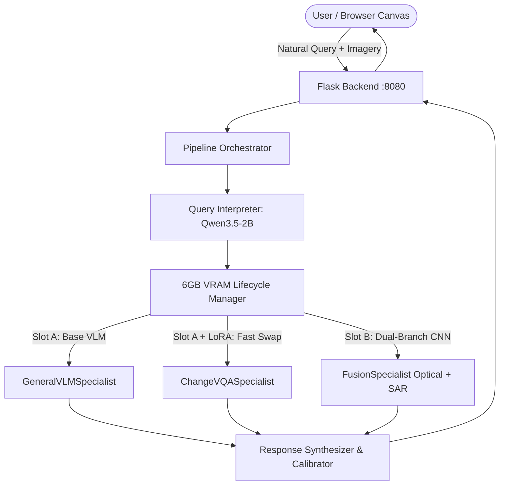

# SatQuery AI: Intelligent Multi-Specialist Satellite Intelligence System

[](https://opensource.org/licenses/MIT)
[](https://www.python.org/)
[-green.svg)](https://nvidia.com)

**SatQuery AI** is an end-to-end multi-specialist satellite question-answering and geospatial intelligence platform engineered to execute complex Earth Observation (EO) queries under a strict **6GB VRAM budget** on consumer/laptop GPUs (such as the NVIDIA RTX 4050).

---

## 🌟 Key Capabilities

1. **Natural Language Geospatial Understanding**:
   - Converts natural language questions into multi-step execution plans across diverse satellite sensors and analytical specialists.
   - Resident Query Interpreter powered by a quantized LLM running within ~1.45 GB VRAM.

2. **6GB VRAM Single-Slot Lifecycle Management**:
   - Dynamic swappable model slot policy with **zero-swap weight sharing** between base vision-language models and fine-tuned task adapters.
   - Seamless transitions between general visual reasoning and change detection without memory fragmentation or OOM crashes.

3. **Multi-Specialist Neural Federation**:
   - **Bitemporal Change VQA (`ChangeVQASpecialist`)**: Qwen2.5-VL-3B fine-tuned via LoRA on CDVQA/SECOND datasets for before/after comparative analysis.
   - **General VLM Intelligence (`GeneralVLMSpecialist`)**: High-resolution single-image VQA, landcover identification, scene captioning, and bounding box grounding.
   - **Optical-SAR Dual-Branch Fusion (`FusionSpecialist`)**: Custom dual-stream CNN fusing Sentinel-2 Optical (RGB) and Sentinel-1 SAR (Radar) tensors with Grad-CAM spatial heatmaps.

4. **Calibrated Confidence & Scientific Honesty**:
   - Clear distinction between statistically calibrated probabilities (sigmoid CNN outputs) and greedy token certainty, mitigating LLM hallucinations in mission-critical remote sensing.

5. **Interactive Web Canvas Experience**:
   - 60fps canvas scroll scrubbing engine with telemetry HUD, sensor layer toggles, split-screen bitemporal sliders, and real-time query streaming.

---

## 🏗 System Architecture



---

## 📂 Project Structure

```
satquery/
├── server.py                        # Flask backend REST API & WebSocket server
├── run_train.sh                     # Training launcher script
├── checkpoints/                     # Trained weights & adapters
│   ├── fusion_model.pt              # Trained weights for Optical-SAR dual-branch CNN
│   └── qwen2.5-vl-cdvqa-lora/       # Trained LoRA adapter for Change VQA
├── scripts/                         # Core execution pipeline & model specialists
│   ├── orchestrator.py              # Central pipeline dispatcher
│   ├── model_lifecycle_manager.py   # 6GB VRAM slot manager
│   ├── model_registry.py            # Specialist loaders & weight-sharing groups
│   ├── interpreter.py               # Natural language query interpreter
│   ├── general_vlm_specialist.py    # General VLM (VQA, captioning, grounding)
│   ├── qwen_specialist.py           # Change VQA LoRA specialist
│   ├── fusion_model.py              # Dual-sensor Optical-SAR fusion CNN & Grad-CAM
│   ├── location_acquisition.py      # Geographic coordinate & imagery resolution
│   └── keyword_fallback.py          # Deterministic regex fallback router
├── ui/                              # Web frontend canvas
│   ├── index.html                   # Interactive UI layout
│   ├── styles.css                   # Glassmorphic responsive styling
│   ├── app.js                       # Client logic, HUD telemetry, frame scrubber
│   ├── preview/                     # Splash preview assets
│   └── frames/                      # 60fps video canvas frame sequence
├── docs/                            # Deep-dive documentation & technical specs
│   ├── SATQUERY_MASTER_CONTEXT.md   # Complete system technical handbook
│   ├── SATQUERY_PRESENTATION_DECK.md# Presentation deck & slides
│   ├── FEASIBILITY_ANALYSIS.md      # Feasibility & deployment analysis
│   └── TECH_STACK.md                # Technology choices & architectural rationale
└── tests/                           # Integration & unit test suites
```

---

## 🚀 Quick Start

### 1. Environment Setup

```bash
# Clone the repository
git clone https://github.com/pavitravashishtha/satquery.git
cd satquery

# Create and activate environment
conda create -n satquery python=3.10 -y
conda activate satquery

# Install dependencies
pip install torch torchvision --index-url https://download.pytorch.org/whl/cu121
pip install transformers accelerate peft flask flask-cors pillow pydantic
```

### 2. Base Model Setup

SatQuery uses `Qwen/Qwen2.5-VL-3B-Instruct` as the resident VLM backbone. The system automatically downloads it from Hugging Face on first execution, or you can point to a local directory in `scripts/qwen_specialist.py`.

Pretrained LoRA adapters (`checkpoints/qwen2.5-vl-cdvqa-lora/`) and the Dual-Branch CNN weights (`checkpoints/fusion_model.pt`) are included in this repository.

### 3. Launch the Server

```bash
python server.py
```

The server will start on `http://localhost:8080`. Open your browser to explore the SatQuery canvas.

---

## 🧪 Evaluation & Testing

Run the test harness to verify specialists and lifecycle management:

```bash
# Test lifecycle VRAM management
python -m pytest tests/test_fix3_lifecycle.py

# Test query dispatch & routing
python -m pytest tests/test_fix1_dispatch.py

# Run full integration tests
python -m pytest tests/test_final_integration.py
```

---

## 📖 Documentation

For full architectural blueprints, memory profiling charts, and benchmark evaluation details, see:
- [SATQUERY_MASTER_CONTEXT.md](docs/SATQUERY_MASTER_CONTEXT.md)
- [TECH_STACK.md](docs/TECH_STACK.md)
- [SATQUERY_PRESENTATION_DECK.md](docs/SATQUERY_PRESENTATION_DECK.md)

---

## 📄 License

MIT License. See [LICENSE](LICENSE) for details.
