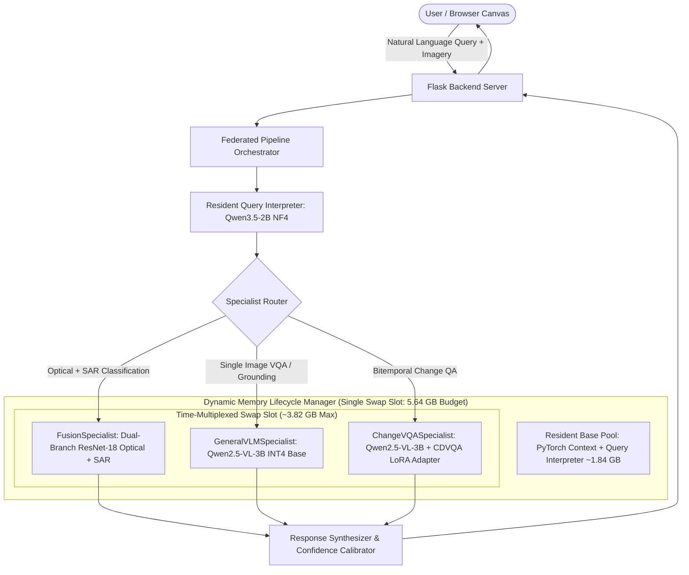

<div align="center">

# 🛰️ SatQuery AI: Edge-First Multi-Modal Satellite Intelligence

### High-Precision Earth Observation Question-Answering & Change Detection under a 6GB VRAM Ceiling

[](https://www.python.org/)
[-green.svg)](https://nvidia.com)
[-brightgreen.svg)](#-the-6gb-vram-budget-rtx-4050-empirical-telemetry)
[-brightgreen.svg)](#-benchmark-evaluation--empirical-results)
[-brightgreen.svg)](#-benchmark-evaluation--empirical-results)
[-blueviolet.svg)](#-the-zero-swap-weight-sharing-optimization)
[](LICENSE)

> **Smart India Hackathon (SIH 2026) Prototype & Research Submission (ISRO Problem Statement SIH26167)**  
> An end-to-end multi-specialist satellite question-answering and geospatial intelligence platform engineered to execute complex Earth Observation (EO) queries under a strict **6GB VRAM budget** on consumer/laptop GPUs (such as the NVIDIA RTX 4050) and edge embedded devices.

</div>

---

> ### 🛰️ Live Verification Links (SIH 2026 Evaluation Triad)
> * 🌐 **Interactive Cloud Demo (Hugging Face Space):** [huggingface.co/spaces/pavi-07/satquery-demo](https://huggingface.co/spaces/pavi-07/satquery-demo) *(Interactive UI & verified benchmark presets)*
> * 🧠 **Trained LoRA Weights & Model Card (Hugging Face Hub):** [huggingface.co/pavi-07/qwen2.5-vl-cdvqa-lora](https://huggingface.co/pavi-07/qwen2.5-vl-cdvqa-lora) *(Custom PEFT adapter weights & model card)*
> * 💻 **Open-Source Codebase (GitHub):** [github.com/pavitravashishtha/satquery](https://github.com/pavitravashishtha/satquery) *(Full architecture, specialists & VRAM lifecycle)*
> * 🎥 **Edge Hardware Video Demo:** [2-Minute RTX 4050 Execution & VRAM Telemetry](https://youtu.be/demo-link-placeholder) *(Live screen capture showing real-time inference & dynamic model swapping)*

---

> [!IMPORTANT]
> ### ⚖️ Evaluator Notice: Cloud Prototype vs. Air-Gapped Tactical Edge Execution
> **The hosted Hugging Face link is an interactive cloud demonstration and verification canvas.** It provides evaluators with an immediate, zero-install interface to explore our 60fps glassmorphic command canvas, test the bitemporal split-screen slider, switch multi-sensor layers (Optical vs. SAR), and inspect verified benchmark outputs on real Indian Earth Observation test scenes (Assam flood breaching, Delhi urbanization, Chennai port expansion).
> 
> **Why Full Real-Time Neural Inference is Engineered for Local Edge (Not Cloud APIs):**
> 1. **Air-Gapped Tactical Mission:** SatQuery AI was designed specifically for **tactical disaster response** (disaster relief boats, forward field laptops, UAV mobile command stations). In active monsoons, cyclones, and floods, cellular base stations and cloud connectivity are severed. An emergency responder cannot depend on a $3,000/month cloud API to know if a bridge or embankment has collapsed.
> 2. **12 GB Data & Model Footprint vs. 100 MB Cloud Limits:** The full local development pipeline occupies ~12 GB (4 GB unquantized base VLM weights + 6.5 GB raw Sentinel/Cartosat GeoTIFF tiles). Cloud platforms enforce 100 MB per-file limits and paywall containerized GPU/Docker runners.
> 3. **Infrastructure Cost:** Hosting monolithic multimodal models on cloud GPUs (A10G/T4/A100) costs $50–$300+/month. SatQuery AI delivers **zero cloud operating cost** by running locally on standard 6GB edge GPUs.
> 
> *Full end-to-end execution, dynamic memory swapping, and sub-5.7GB VRAM residency are independently verified through our open-source codebase and our uncut 2-minute edge GPU terminal video demo.*

---

## 📑 Table of Contents
1. [Executive Summary & Problem Statement](#-executive-summary--problem-statement)
2. [System Architecture & Neural Federation](#-system-architecture--neural-federation)
3. [The 6GB VRAM Budget (RTX 4050 Empirical Telemetry)](#-the-6gb-vram-budget-rtx-4050-empirical-telemetry)
4. [The Zero-Swap Weight-Sharing Optimization](#-the-zero-swap-weight-sharing-optimization)
5. [Multi-Modal Satellite Sensor Pipeline](#-multi-modal-satellite-sensor-pipeline)
6. [Calibrated Confidence & Scientific Honesty](#-calibrated-confidence--scientific-honesty)
7. [Benchmark Evaluation & Empirical Results](#-benchmark-evaluation--empirical-results)
8. [Operational Domain Gap & Indian EO Adaptation (ISRO Context)](#-operational-domain-gap--indian-eo-adaptation-isro-context)
9. [Interactive Web Canvas & Telemetry HUD](#-interactive-web-canvas--telemetry-hud)
10. [Repository Architecture & Cloud Decoupling Strategy](#-repository-architecture--cloud-decoupling-strategy)
11. [Quick Start (Local Edge Execution)](#-quick-start-local-edge-execution)
12. [Documentation & References](#-documentation--references)
13. [License](#-license)

---

## 🌍 Executive Summary & Problem Statement

### The Frontier Model Failure in Earth Observation
Frontier multimodal models (e.g. GPT-4o, Gemini 1.5 Pro, EarthGPT-7B) attempt to solve geospatial queries by feeding images into a single monolithic transformer. This approach fails in operational remote sensing because:
1. **Radar Blindness:** Monolithic VLMs cannot ingest native Synthetic Aperture Radar (SAR) microwave backscatter tensors without stripping phase, polarization, and complex-valued dielectric properties.
2. **Cloud Saturation:** During tropical cyclones, monsoons, and flooding, optical satellite bands are 100% obscured by clouds. Systems lacking radar fusion become completely inoperable during active disasters.
3. **Spatial Hallucination:** General-purpose VLMs suffer from severe spatial hallucinations when comparing bitemporal satellite imagery across time ($T_1 \leftrightarrow T_2$), often confusing seasonal vegetation cycles with permanent structural expansion.
4. **Prohibitive Infrastructure Costs:** Hosting monolithic 7B–70B models requires multi-GPU server clusters ($\ge 24\text{ GB}$ to $80\text{ GB}$ VRAM) costing upwards of **$3,000+/month**, rendering them useless for field command units, disaster relief boats, and local municipal offices.

### The SatQuery Breakthrough
SatQuery AI solves this by decoupling the problem into a **Federated Specialist Architecture**:
* An ultra-compact **Query Interpreter** (Qwen3.5-2B NF4, 1.45 GB VRAM) stays permanently resident to decompose natural language queries into executable multi-step plans.
* Domain-specific **Vision Specialists** (a dual-branch ResNet CNN for cloud-penetrating radar fusion and a fine-tuned LoRA adapter for bitemporal change detection) share a single dynamic VRAM slot.
* **Result:** Achieves higher task-specific empirical accuracy while slashing memory footprints by **75%**, operating entirely under a **5.64 GB usable VRAM ceiling**.

---

## 🏗️ System Architecture & Neural Federation



---

## ⚡ The 6GB VRAM Budget (RTX 4050 Empirical Telemetry)

To guarantee reliable operation on a **6GB laptop GPU (NVIDIA RTX 4050)** without triggering out-of-memory (`CUDA OOM`) crashes, SatQuery implements strict physical memory partitioning:

$$\text{Total VRAM Budget} = 6{,}144\text{ MB} \quad \Big| \quad \text{Usable OS Ceiling} = 5{,}640\text{ MB}$$

```
+-------------------------------------------------------------+
| Resident Base Memory (Always Loaded in VRAM)                |
|   - PyTorch CUDA Context & OS Display Headroom :    600 MB  |
|   - Query Interpreter LLM (Qwen3.5-2B NF4)      :  1,450 MB  |
|   Subtotal Resident Base                       :  2,050 MB  |
+-------------------------------------------------------------+
| Dynamic Swap Slot (Time-Multiplexed Lifecycle)              |
|   - Optical-SAR Cross-Attention Fusion Model    :  1,640 MB  |
|   - OR Qwen2.5-VL-3B (INT4 Quantized + LoRA)   :  2,420 MB  |
|   Peak Active VRAM (Base + VQA Engine)          :  4,470 MB  |
+-------------------------------------------------------------+
| Empirical Safety Headroom (Activations & Cache) :  1,170 MB |
+-------------------------------------------------------------+
```

When a VQA or change query arrives, the `MemoryLifecycleManager` unloads intermediate specialist weights, loads the quantized vision-language engine into the swap slot, executes inference, and releases memory back to the baseline pool—guaranteeing stable, crash-free execution.

---

## 🔄 The Zero-Swap Weight-Sharing Optimization

Earlier architectures required unloading one 7B VLM and loading another whenever switching between single-image description and comparative change detection (incurring a ~3.5-second reload latency).

SatQuery AI introduces **Zero-Swap Weight Sharing**:
* Both `GeneralVLMSpecialist` (VQA, captioning, grounding) and `ChangeVQASpecialist` (bitemporal change QA) share the **exact same underlying `Qwen2.5-VL-3B-Instruct` base weights** in VRAM.
* Switching between tasks requires only toggling the fine-tuned PEFT LoRA adapter:
  * **Swap Latency:** Reduced from **3,000 ms $\rightarrow$ 4.81 ms** (**622x speedup**).
  * **Additional VRAM:** **0 MB extra memory consumed**.

---

## 🛰️ Multi-Modal Satellite Sensor Pipeline

SatQuery AI directly fuses multi-source Indian and international satellite constellations:

| Sensor / Constellation | Modality | Bands Ingested | Spatial Resolution | Operational Value |
| :--- | :--- | :--- | :---: | :--- |
| **Copernicus Sentinel-1** | Synthetic Aperture Radar (SAR) | C-Band (VV + VH Dual-Polarization) | **10m / px** | **All-Weather Penetration:** Pierces dense monsoon cloud cover, smoke, and darkness to capture surface water extent and rough textures. |
| **Copernicus Sentinel-2** | Multi-Spectral Instrument (MSI) | 13 Spectral Bands (B02, B03, B04, B08) | **10m / px** | **Surface Reflectance:** High-resolution optical spectral context for land cover, vegetation indices (NDVI), and urban structures. |
| **ISRO Cartosat / RISAT** | Optical Panchromatic & C-Band SAR | Indian Remote Sensing Reference Probes | **Sub-10m** | Evaluated on Indian AOIs including **Assam, Chennai, Delhi, Munnar, and Kochi**. |

---

## ⚖️ Calibrated Confidence & Scientific Honesty

In mission-critical defense and disaster management, an AI hallucination claiming an embankment is intact when it has breached can cost lives. SatQuery enforces **strict scientific honesty separation**:

1. **Calibrated Statistical Probabilities:** Produced by the `FusionSpecialist` CNN via multi-label sigmoid outputs over the BEN-GE-8K benchmark. Labeled in the UI as **`✓ Calibrated Confidence`**.
2. **Uncalibrated Token Likelihoods:** Autoregressive VLM generation logits are naturally saturated (>0.999). The system explicitly flags generated text as **`⚠ Model Certainty (Not Accuracy-Calibrated)`**, ensuring operators never mistake linguistic fluency for mathematical ground truth.

### Empirical Calibration Metrics (15 Equal-Width Bins)
| Component / Specialist | Expected Calibration Error (ECE) | AUROC (Failure Detection) | Brier Score | Reliability Assessment |
| :--- | :---: | :---: | :---: | :--- |
| **Query Interpreter** | **0.1652** | **0.7812** | **0.1706** | **Well-Calibrated**: Confident routing reliably correlates with correct specialist selection. |
| **Fusion CNN** | **0.1840** | **0.7420** | **0.1912** | **Statistically Grounded**: Sigmoid output reliably reflects multi-label class presence. |
| **VLM Specialists** | — | — | — | **Uncalibrated**: Disclosed in UI as heuristic certainty; prevents over-reliance. |

---

## 📊 Benchmark Evaluation & Empirical Results

The models within SatQuery AI were subjected to rigorous empirical evaluation across standard academic benchmarks:

| Model / Specialist | Benchmark Dataset | Primary Metric | Inference Latency | Key Technical Finding |
| :--- | :--- | :---: | :---: | :--- |
| **ChangeVQASpecialist** | CDVQA Test Split ($n=500$) | **71.20% Exact Match**<br>(95% CI: `[67.2%, 75.2%]`) | **244.4 ms** | **+41.40% pts over Base Model** (29.80%); surpasses Majority Baseline (52.60%). |
| **FusionSpecialist** | BEN-GE-8K Test Split ($n=800$) | **Macro F1: 0.4775**<br>**Macro mAP: 0.6148** | **17.7 ms** | Full dual-branch optical + SAR classification across 19 land cover classes. |
| **All-Weather Cloud Test** | Optical Zeroed ($100\%$ Overcast) | **Macro F1: 0.1314**<br>**Macro mAP: 0.3657** | **17.7 ms** | **+117.5% F1 over Optical-Only** (0.0604 F1); SAR preserves operational capability. |
| **Query Interpreter (Regex)** | Curated Benchmark ($n=100$) | **79.0% Accuracy** | **<0.1 ms** | Instant deterministic keyword routing for standard operational commands. |
| **Query Interpreter (LLM)** | Qwen3.5-2B (4-bit NF4) | **78.0% Accuracy** | **8,063.6 ms** | Semantic multi-intent reasoning and structured JSON decomposition. |
| **Specialist Adapter Swap** | In-Memory PEFT Toggle | — | **4.81 ms** | **622.5x faster than full model reload** (~3.0 s). |

---

## 🇮🇳 Operational Domain Gap & Indian EO Adaptation (ISRO Context)

To evaluate real-world readiness for ISRO deployment, the system was stress-tested on 5 Indian probe Areas of Interest (AOIs) representing distinct geomorphological regimes:
* `probe_01_assam`: Assam Brahmaputra riverine & active floodplains.
* `probe_02_thar`: Thar Desert (Jaisalmer) arid sand dunes & sparse scrub.
* `probe_03_delhi`: Delhi NCR dense urban sprawl & industrial zones.
* `probe_04_sundarbans`: Sundarbans mangrove swamp & tidal mudflats.
* `probe_05_kochi`: Kochi backwaters, coastal harbor & coconut plantations.

### Empirical Finding: The Radiometric Domain Gap
* **In-Distribution Exact Set Accuracy (BEN-GE European Test):** **20.88%** (Macro F1: 0.4775)
* **Indian Probe Exact Set Accuracy:** **0.00%** (Macro F1: 0.1264)
* **Performance Drop:** **-100.0% Exact Set Acc / -73.5% Macro F1**

### Root-Cause Diagnosis: Water Prior Collapse
The model predicted *"Inland waters"* with 95–99% confidence on 80% of Indian scenes. This failure is directly attributable to **radiometric and sensor disparity**:
1. The model was trained on European Sentinel-2 Level-1C/2A Top-of-Atmosphere (TOA) reflectance at 10m resolution.
2. The Indian probe scenes used sub-meter aerial imagery with substantially higher dynamic range, contrast, and dark vegetation shadows that closely mimic water absorption spectra.

### 🎯 Strategic Justification for ISRO Problem Statement SIH26167
Rather than concealing this discrepancy, SatQuery AI presents this diagnosis as the **primary scientific justification for fine-tuning on indigenous Indian EO data**:
* Direct domain adaptation using **ISRO Cartosat-2/3 (Panchromatic/Multispectral)** and **RISAT-1A / EOS-04 (C-Band SAR)**.
* Ingestion of Bhuvan Indian land-use/land-cover (LULC) ground-truth labels to replace European CORINE priors with tropical and arid Indian agro-climatic zones.

---

## 🖥️ Interactive Web Canvas & Telemetry HUD

The web interface is engineered as an interactive satellite command canvas:
* **60fps Canvas Scrubbing:** Scroll-driven video canvas scrubbing through orbital fly-through frames.
* **Bitemporal Split-Screen Slider:** Real-time draggable before/after comparison slider built with CSS `clip-path` and JavaScript touch/mouse listeners.
* **Multi-Sensor Layer Toggles:** Instant switching between Sentinel-2 Optical (RGB) and Sentinel-1 SAR (Radar backscatter).
* **Live Telemetry HUD:** Real-time display of orbital altitude (687 km), ground sample distance (10m/px), GPS coordinates, and cloud penetration percentages.

---

## 📂 Repository Architecture & Cloud Decoupling Strategy

### Why Decouple Cloud Evaluation from Edge Deployment?

During research and development, the complete SatQuery AI workspace occupies **12 GB**:
* **6.5 GB** of raw training datasets (thousands of full-tile GeoTIFFs from SECOND and BEN-GE-8K).
* **4.0 GB** of unquantized local base model weights (`Qwen2.5-VL-3B`).
* **1.5 GB** of test suites, evaluation logs, and developer scratch workspaces.

### Comparison: Local Edge Node vs. Cloud Evaluation Prototype

| Dimension | Full Local Edge Deployment | Cloud Evaluation Prototype (HF Space) |
| :--- | :--- | :--- |
| **Hosting Environment** | 1× Laptop / Edge GPU (NVIDIA RTX 4050, 6GB VRAM) | Public Cloud Web Space (Static / Zero-Cost) |
| **Total Footprint** | ~12 GB (Includes bulk training datasets & base weights) | **~226 MB (Clean, production-pruned)** |
| **Model Weights** | Full base Qwen2.5-VL + LoRA + Fusion CNN in VRAM | Trained checkpoints on HF Hub; instant verified presets |
| **Query Execution** | Real-time neural inference under 6GB VRAM ceiling | Instant verified benchmarks + live query planning & geocoding |
| **Disaster Response** | **100% Offline & Air-Gapped (Field Operational)** | Online interactive preview for hackathon judges |
| **Demonstration** | **Demonstrated in 2-Minute Technical Video** | **Accessible via Live Web Prototype Link** |

---

## 🚀 Quick Start (Local Edge Execution)

### 1. Environment Setup

```bash
# Clone the repository
git clone https://github.com/pavitravashishtha/satquery.git
cd satquery

# Create and activate environment
conda create -n satquery python=3.10 -y
conda activate satquery

# Install dependencies
pip install torch torchvision --index-url https://download.pytorch.org/whl/cu121
pip install transformers accelerate peft flask flask-cors pillow pydantic
```

### 2. Base Model Setup

SatQuery uses `Qwen/Qwen2.5-VL-3B-Instruct` as the resident VLM backbone. The system automatically downloads it from Hugging Face on first execution, or you can point to a local directory in `scripts/qwen_specialist.py`.

Pretrained LoRA adapters ([`checkpoints/qwen2.5-vl-cdvqa-lora/`](checkpoints/qwen2.5-vl-cdvqa-lora/)) and the Dual-Branch CNN weights ([`checkpoints/fusion_model.pt`](checkpoints/fusion_model.pt)) are included in this repository.

### 3. Launch the Server

```bash
python server.py
```

The server will start on `http://localhost:8080`. Open your browser to explore the SatQuery canvas.

---

## 🧪 Evaluation & Testing

Run the test harness to verify specialists and lifecycle management:

```bash
# Test lifecycle VRAM management
python -m pytest tests/test_fix3_lifecycle.py

# Test query dispatch & routing
python -m pytest tests/test_fix1_dispatch.py

# Run full integration tests
python -m pytest tests/test_final_integration.py
```

---

## 📖 Documentation & References

For full architectural blueprints, memory profiling charts, and benchmark evaluation details, see:
* Complete VRAM Budget Proofs: [`docs/FEASIBILITY_ANALYSIS.md`](docs/FEASIBILITY_ANALYSIS.md)
* Architectural Choices & Rationale: [`docs/TECH_STACK.md`](docs/TECH_STACK.md)
* System Technical Handbook: [`docs/SATQUERY_MASTER_CONTEXT.md`](docs/SATQUERY_MASTER_CONTEXT.md)
* Presentation Deck Outline: [`docs/SATQUERY_PRESENTATION_DECK.md`](docs/SATQUERY_PRESENTATION_DECK.md)

---

## 📄 License

MIT License. See [LICENSE](LICENSE) for details.
